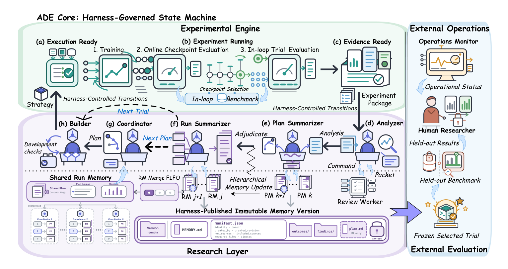

<div align="center">

# ADE: Agentic Data Engineering

**ADE — agents that develop data selection, reward and curriculum strategies through controlled experiments.**

<!-- [Live Demo](https://ade-code-research.ruomengd.chatgpt.site) -->
[Quickstart](docs/en/quickstart.md) · [Walkthrough](docs/en/walkthrough.md) · [Documentation](docs/en/README.md)

</div>

ADE gives agents control over research decisions under fixed experimental protocols.
Agents propose and implement strategies, analyze experimental evidence and build cumulative
Memory. A Harness governs accepted state transitions, while the Engine executes training
and evaluation. Strategy selection uses in-loop results; held-out evaluation stays outside
the research feedback loop.

**Start here:** [Install](docs/en/installation.md) → [Prepare inputs](docs/en/data-preparation.md) →
[Configure deployment](docs/en/deployment.md) → [Give an Operation Prompt to the supervising Agent](docs/en/quickstart.md).

<!--
**[Explore the interactive demo](https://ade-code-research.ruomengd.chatgpt.site)** — Follow a code data-selection run through strategy development, shared findings and recorded training curves.
-->

## Framework

[](docs/assets/ade-pipeline.pdf)

Agents develop strategies from Experiment Packages and Memory; the Engine executes controlled experiments.
An external supervising Agent handles operation, monitoring and recovery using a repository Skill.

A Run first evaluates the base model and trains a baseline. ADE then proposes a Plan,
implements its strategy, trains and evaluates a Trial, and records the analysis in Memory.
Later Plans use that evidence to choose their next intervention. Model, training budget
and evaluation rules stay fixed within a Run.

## Quickstart

Every real Run starts with **an Operation Prompt + an exact config**, handed to one
supervising Agent. [`ade-supervise-run`](.agents/skills/ade-supervise-run/SKILL.md)
owns admission, startup, monitoring, operational recovery and terminal acceptance.
ADE launches its research-role workers internally.

1. Install the complete runtime with `bash scripts/recreate_unified_vllm_env.sh` after reading the [prerequisites](docs/en/installation.md).
2. Prepare models/data, the local deployment and assigned Ray nodes using the [walkthrough](docs/en/walkthrough.md).
3. Fill [baseline-operation.md](examples/math-sft/baseline-operation.md) with your checkout, environment, deployment and resource authorization; give it to the supervising Agent.
4. After baseline acceptance, fill [ade-operation.md](examples/math-sft/ade-operation.md) with its actual Run ID and hand off the separate N=1 ADE.

```text
Use $ade-supervise-run to execute the completed Operation Prompt in
<absolute path to your local operation.md> through terminal acceptance.
```

The [example directory](examples/README.md) provides Baseline, ADE N=1 and ADE N=3 prompts with their configurations. Prepare inputs and resources according to the selected config, then follow the [Quickstart](docs/en/quickstart.md) to launch and inspect results.

Want to inspect the workflow without models or GPUs? The optional [CPU demo](docs/en/cpu-demo.md)
uses scripted responses and synthetic scores; it is separate from the supervised real experiment.

## Tasks

| Task | Agent-controlled strategy | Backend | Available domains |
| --- | --- | --- | --- |
| [Data Selection](docs/en/components/data-selection.md) | Selection code over a fixed candidate pool | LlamaFactory SFT | Math, code |
| [Reward Design](docs/en/components/reward-design.md) | Reward implementation | VERL RFT | Math |
| [Curriculum Learning](docs/en/components/curriculum-learning.md) | Training-data schedule | VERL RFT | Math |

The [configuration matrix](configs/README.md) contains baseline, N=1 and N=3 entries.
Each Run freezes its task contract, inputs, training/evaluation settings and ADE budget.
Read [results](docs/en/results.md) for Trial Records, rankings and Memory. See [operator test and final generalization](docs/en/generalization.md) for held-out datasets and the final evaluation workflow.

## Documentation

| Guide | Documentation |
| --- | --- |
| Start with a supervising Agent | [Quickstart](docs/en/quickstart.md) |
| Operation Prompt → baseline → ADE → results | [Walkthrough](docs/en/walkthrough.md) |
| Runtime and dependencies | [Installation](docs/en/installation.md) |
| Models and datasets | [Inputs](docs/en/data-preparation.md) |
| Cluster and resources | [Deployment](docs/en/deployment.md) · [Ray](docs/en/ray-cluster.md) |
| Operation and process ownership | [CLI](docs/en/operations.md) · [Services](docs/en/service-lifecycle.md) |
| Implementation and extension | [Components](docs/en/components/README.md) |
| Evidence, scores and Memory | [Results](docs/en/results.md) |
| Help | [FAQ](docs/en/faq.md) |

## Repository

- `ade/`: Harness/Control, research Agents, Engine, tasks, evaluation and Memory.
- `.agents/skills/`: operator supervision and research-role Skills.
- `examples/`, `configs/`, `prompts/`: Operation Prompts, fixed experiment configs and model prompts.
- `docs/`: usage and component guides.
- `scripts/`, `dataset/`, `requirements/`: environment and input preparation.
- `third_party/llamafactory/`, `third_party/verl/`: included training backends.

See [AGENTS.md](AGENTS.md) for contributor-Agent instructions.

## License

[LICENSE](LICENSE) is a placeholder pending the project license and copyright details.
Third-party components retain their own licenses; see [THIRD_PARTY_NOTICES.md](THIRD_PARTY_NOTICES.md).

## Citation

Citation metadata is pending. [CITATION.bib](CITATION.bib) reserves the paper title;
replace the placeholder with the final authors, publication details and public URL before citing.
