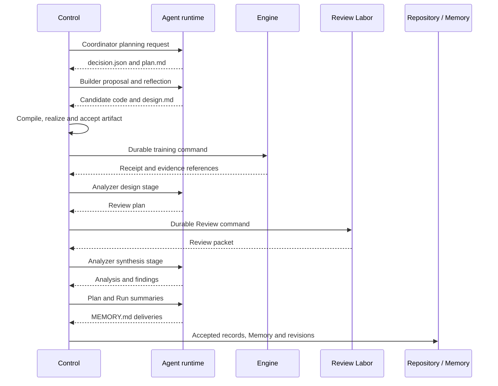

# Architecture and execution boundaries

[Components](README.md)

## Objects and ownership

A Run binds task, scientific configuration, resource identity and search budget. Search Coordinators own Plans; a Plan defines a direction and its comparator relationship; a Trial binds a candidate artifact, execution, analysis and summaries. Bootstrap provides an accepted reference before search. N in formal N=1/N=3 configurations counts search Coordinators.

Control owns accepted RunState changes. Harness compiles configuration and assembles processes; Supervisor manages their lifetime. Agent runtime, Engine and Review workers are separate execution systems. Each returns a delivery or receipt; none can directly declare its work accepted in RunState.

The operator-side [supervising Agent](supervision.md) sits outside this scientific loop. It receives an Operation Prompt and fixed config, launches the Python Supervisor and monitors the Run through terminal acceptance. Start a real experiment with the [Quickstart](../quickstart.md); the [CPU demo](../cpu-demo.md) is optional.

## One Trial's flow

This shows the successful path. Builder realization may include Judge work; retry, partial evidence and failure branches remain governed by the task and state-machine contracts. Shared planning is serialized while independent Coordinator work can proceed concurrently; concurrency does not create multiple writers of accepted state.

## Use and inspect

Start with the [CPU demo](../cpu-demo.md), then follow [operations](../operations.md) for real baseline → search execution. `summary.json` in the demo points to a Trial Record and published Memory. The [results guide](../results.md) maps them to state fields. Read [Control](control.md), [Agent runtime](agent-runtime.md), [Engine](engine.md) and [Memory](memory-workspace.md) to follow this sequence in code.

If a Run waits, locate the pending role/command in persisted state before investigating its worker. A missing revision during a poll is normal when no new fact is accepted.

## Implementation entry points

| Source | Responsibility |
| --- | --- |
| [ade/core/run.py](../../../ade/core/run.py) | RunState and lifecycle types |
| [ade/controller/workflow_driver.py](../../../ade/controller/workflow_driver.py) | End-to-end reconciliation |
| [ade/harness/wiring.py](../../../ade/harness/wiring.py) | Component assembly |
| [ade/harness/supervisor.py](../../../ade/harness/supervisor.py) | Supervised process lifetime |
