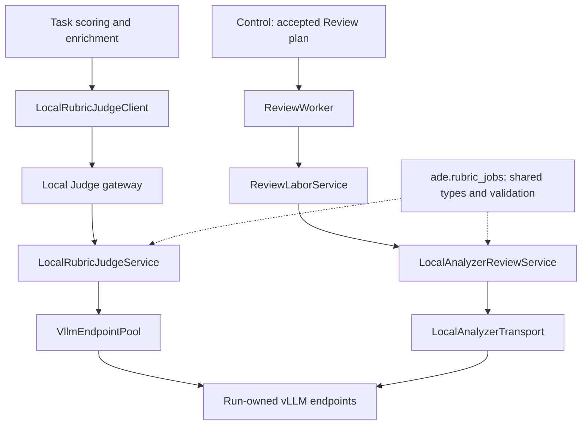

# Review Labor, Rubric Jobs and Local Judge

[Components](README.md)

## Distinct responsibilities

The three packages separate the review workflow, the shared job protocol and local model execution.

| Component | Responsibility | Result |
| --- | --- | --- |
| `ade/review_labor` | Executes an Analyzer-designed investigation over frozen evidence, submitted by Control | Review receipt, packet and coverage used by Analyzer synthesis |
| `ade/rubric_jobs` | Defines provider-neutral job schemas, rubric validation and serialization; it runs no model or worker | Input rows, job states, per-item results/errors and token usage |
| `ade/local_rubric_judge` | Provides the local judging gateway, client, job execution and model-service lifecycle for task scoring and enrichment | Durable job results, status and audit data |

Training-time or Builder-time rubric calls are not the Analyzer's Review stage. `judge_enrichment.enabled` controls a task capability; `analysis.review_required` and its provider control Analyzer Review. Disabling enrichment does not imply that formal analysis needs no Review service.

## Two execution paths

Task-level judging and Analyzer Review use the Run's model endpoints through separate execution paths:



For task scoring and enrichment, `LocalRubricJudgeClient` submits jobs through the gateway. `LocalRubricJudgeService` persists and executes those jobs, and `VllmEndpointPool` sends model requests.

Analyzer first delivers a Review plan. Harness validates evidence bindings and creates a scoped `ReviewCommand` containing batches, units and rubrics. `ReviewWorker` claims it through its own durable queue; the configured processor executes it and returns `completed`, `completed_with_errors` or `failed`. Control accepts a Review packet before requesting Analyzer synthesis.

Analyzer Review uses `LocalAnalyzerReviewService`, backed by `ReviewLaborJobService` in `review_labor/jobs.py`. Its `LocalAnalyzerTransport` constructs Review-specific prompts, calls the Run's vLLM endpoints directly and normalizes responses. This path does not submit jobs through the Local Judge gateway.

The paths share Rubric Job types and validation, including input rows, states, results, errors and usage. They have separate job-service implementations, persisted state and queues. Sharing the protocol and model endpoints does not make their job IDs, cancellation or recovery interchangeable. Inspect the service that owns the job. Usage can be complete, partial or unavailable; unavailable token counts are not zero.

## Configuration and usage

`configs/analysis/canonical-formal.yaml` selects `local_analyzer` and sets request concurrency, timeouts and retry policy. Deployment `run_resources.local_judge` binds GPU count, model, gateway port, authorization environment variable and executable. Ray selects the host; the admitted service handle records its gateway URL. Task enrichment settings determine whether the supplied capability is available to generated code.

Follow [deployment](../deployment.md) for the configured model-service topology. The supervised Run owns startup/attachment; do not start duplicate manual servers. Inspect CLI options without submitting a job:

```bash
.unified-vllm-0.19.1-verl-venv/bin/ade review worker --help
```

The installed `ade-judge-vllm` entry loads a Judge-specific dependency overlay in its process. Its version split is documented in [installation](../installation.md); it does not change the training environment. The CPU demo scripts Review responses and does not validate the real service.

## Evidence and diagnosis

Inspect the Trial Record's Review plan, packet and coverage alongside job status and per-item errors. Partial/advisory review must be interpreted under the configured analysis contract, not converted silently into full coverage. A schema error, model timeout and missing gateway authorization are different failures. Follow exact command/job IDs; do not resubmit an entire scientific Trial merely because a model request is slow.

## Review coverage

Readable schema-invalid output is retained as advisory fallback, not converted to rubric labels. Output without readable review text is retried within the configured limit; context-limit failures are terminal for that item. Inspect `review_error`, `review_fallback` and per-unit usage in the accepted packet. Report structured, fallback and unavailable counts separately; missing token counts are not zero.

## Implementation entry points

| Source | Responsibility |
| --- | --- |
| [ade/review_labor/protocol.py](../../../ade/review_labor/protocol.py) | Review commands and receipts |
| [ade/review_labor/worker.py](../../../ade/review_labor/worker.py) | Review worker |
| [ade/review_labor/planning.py](../../../ade/review_labor/planning.py) | Review plan binding |
| [ade/review_labor/analyzer_service.py](../../../ade/review_labor/analyzer_service.py) | Analyzer Review job service |
| [ade/review_labor/jobs.py](../../../ade/review_labor/jobs.py) | Review job persistence, execution and recovery |
| [ade/review_labor/local.py](../../../ade/review_labor/local.py) | Direct model transport and response normalization for Analyzer Review |
| [ade/rubric_jobs/models.py](../../../ade/rubric_jobs/models.py) | Rubric Job and usage schemas |
| [ade/local_rubric_judge/client.py](../../../ade/local_rubric_judge/client.py) | Gateway client |
| [ade/local_rubric_judge/service.py](../../../ade/local_rubric_judge/service.py) | Durable Judge service |
| [ade/local_rubric_judge/vllm_endpoint.py](../../../ade/local_rubric_judge/vllm_endpoint.py) | Model transport for task-level judging |
| [ade/local_rubric_judge/lifecycle.py](../../../ade/local_rubric_judge/lifecycle.py) | Run attachment and resource lifetime |
| [ade/local_rubric_judge/vllm_cli.py](../../../ade/local_rubric_judge/vllm_cli.py) | Judge dependency overlay launcher |
| [ade/harness/wiring.py](../../../ade/harness/wiring.py) | Composition of Review workers and task-level Judge clients |
